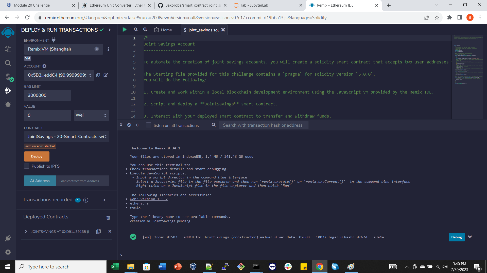
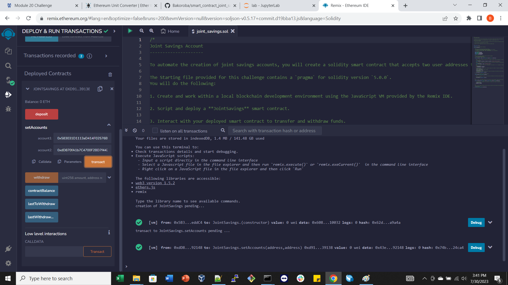
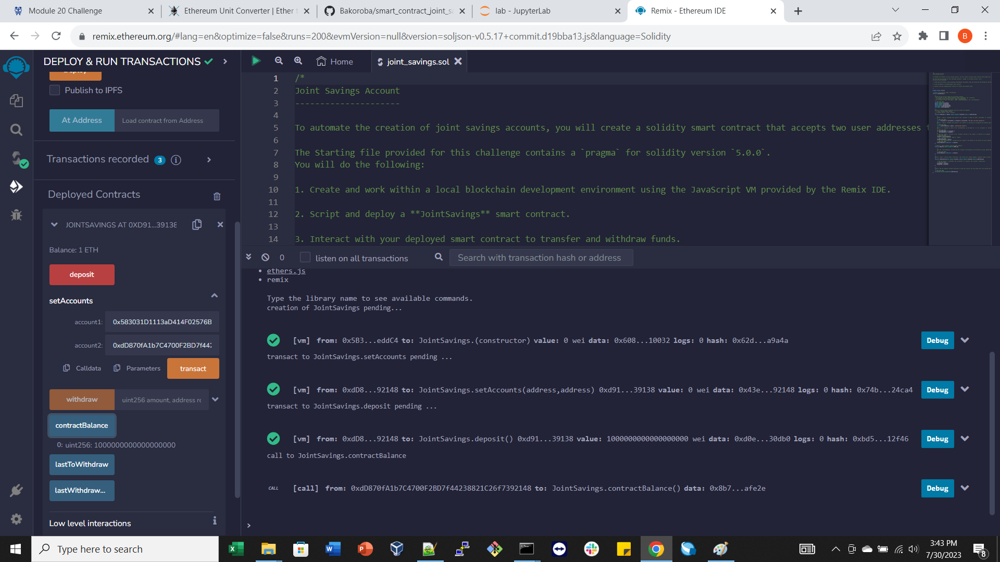
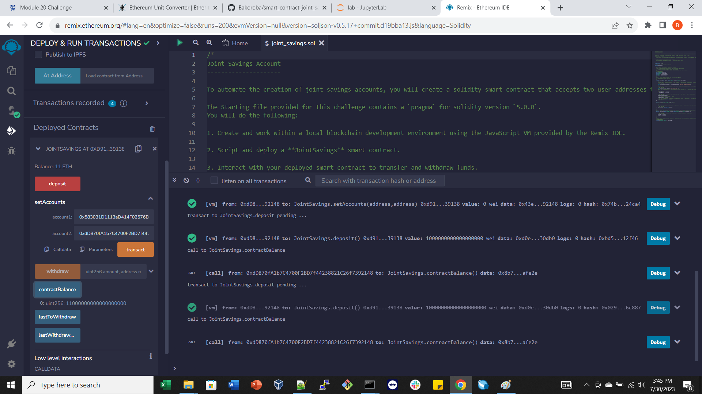
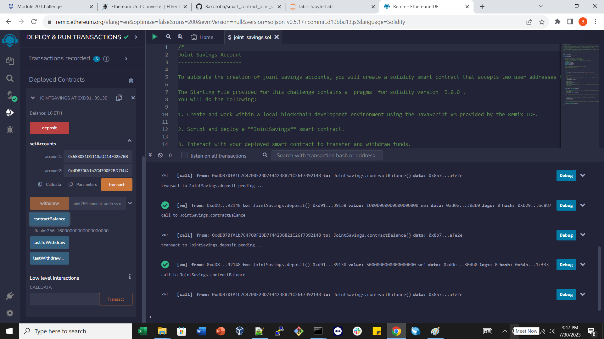
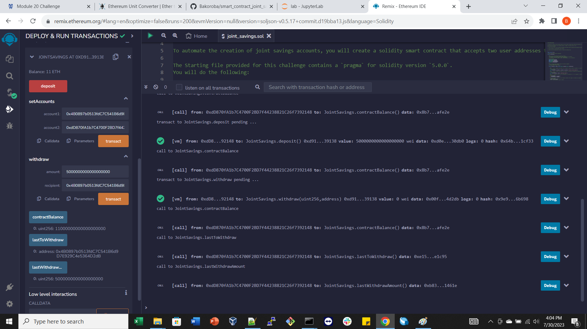
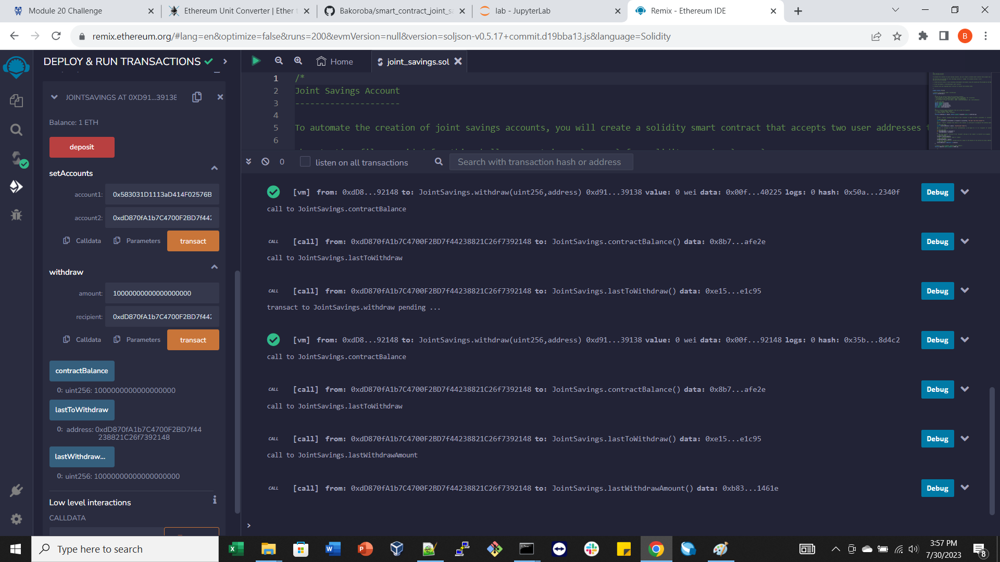

# Smart contract joint savings account
The objective is to create a smart contract that will use ether management functions to implement a financial institution’s requirements for providing the features of the joint savings account. These features will consist of the ability to deposit and withdraw funds from the account.
## Tasks
- Create a Joint Savings Account Contract in Solidity
- Compile and Deploy Your Contract in the JavaScript VM
- Interact with Your Deployed Smart Contract

## Testing the App

1. Define the authorized Ethereum address 
- Compile and deploy

- Authorized addresses

2. Test the deposit functionality of the smart contract
- Transaction 1: Send 1 ether as wei.

- Transaction 2: Send 10 ether as wei.

- Transaction 3: Send 5 ether.

3. Test the contract’s withdrawal functionality

- Withdrawing 5 ether into accountOne

- Withdrawing  10 ether into accountTwo

## Technology
- Solidity
- Remix IDE

## License

MIT